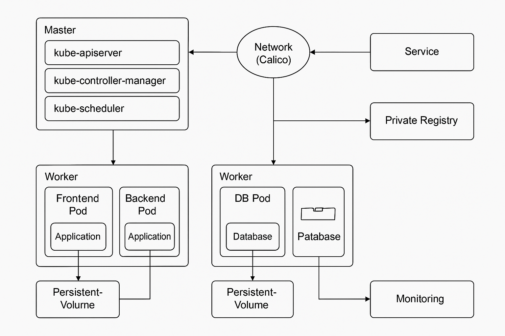

# Projet Cruise - Cluster Kubernetes

Ce projet a pour objectif de déployer un cluster Kubernetes non managé composé d’au moins 3 machines. Il inclut :

- Création d’images Docker (frontend, backend, base de données)
- Déploiement avec des manifests YAML
- Mise en réseau avec Calico
- Registry Docker privée
- Persistance des données avec PV et PVC
- Monitoring (à venir)
- Automatisation (bonus avec Ansible)

## 🗺️ Schéma d’architecture



## 📁 Structure du projet

```
cruise/
├── docker/
│   ├── frontend/
│   │   └── Dockerfile
│   ├── backend/
│   │   └── Dockerfile
│   └── db/
│       └── Dockerfile
├── k8s/
│   ├── namespaces.yaml
│   ├── volumes.yaml
│   ├── frontend-deployment.yaml
│   ├── backend-deployment.yaml
│   ├── db-deployment.yaml
│   ├── frontend-service.yaml
│   ├── backend-service.yaml
│   └── db-service.yaml
└── README.md
```

# Guide d'utilisation - Projet Cruise

## 🐳 Prérequis

- 3 machines Linux (VM ou physiques)
- Ansible installé sur la machine de contrôle
- Accès SSH configuré (clé publique)
- Kubernetes non installé (sera pris en charge par Ansible)
- `kubernetes.core` collection Ansible installée (`ansible-galaxy collection install kubernetes.core`)

## 🚀 Étapes

### 1. Déployer Docker + Kubernetes

Depuis votre machine de contrôle :

```bash
ansible-playbook -i inventory.ini ansible/setup-k8s.yaml
```

### 2. Initialiser le master

Connexion SSH sur la machine master :

```bash
sudo bash init-master.sh
```

Cela affichera un `kubeadm join` à copier sur les workers.

### 3. Appliquer les manifests Kubernetes

Depuis la machine de contrôle :

```bash
ansible-playbook -i inventory.ini ansible/deploy-manifests.yaml
```

---

## 📂 Arborescence des fichiers importants

```
cruise/
├── ansible/
│   ├── setup-k8s.yaml
│   └── deploy-manifests.yaml
├── k8s/
│   └── *.yaml
├── docker/
│   └── */Dockerfile
└── init-master.sh
```


